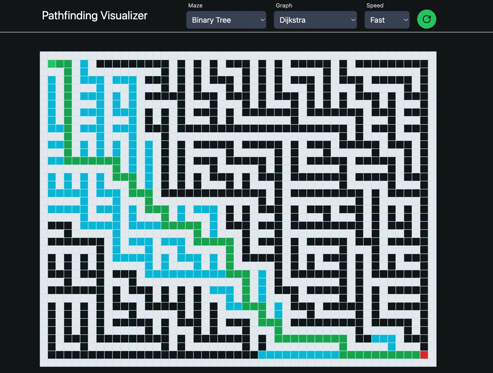

# 🧭 DSA-Based Pathfinding Algorithm Visualizer

An interactive web application to visualize core pathfinding algorithms in real-time. Built using **React**, **TypeScript**, and **Tailwind CSS**, this tool helps demonstrate how different algorithms traverse a grid and find the shortest path between two points.

---

## 🚀 Features

- 🔍 Visualizes popular DSA algorithms:
  - Dijkstra’s Algorithm
  - A\* Search Algorithm
  - Breadth-First Search (BFS)
  - Depth-First Search (DFS)
- 🧱 Maze generation
- ⏱️ Adjustable speed controls
- 🖱️ Interactive grid: draw walls, set start/end nodes
- 🎨 Clean and responsive UI with Tailwind CSS

---

## 🛠️ Tech Stack

- **Frontend:** React, TypeScript, Tailwind CSS
- **Algorithms:** Implemented from scratch using core data structures
- **State Management:** React hooks

---

## 📸 Screenshots

> 

---

## 💡 Purpose

This project was built to deepen understanding of **Data Structures and Algorithms** by applying them in a visual, hands-on format. It demonstrates how graph traversal algorithms behave, their time complexities, and how they handle obstacles and paths.

---

## 🧠 What I Learned

- Implementing classic graph traversal algorithms
- Applying DSA concepts in real-world UI
- Managing state and rendering performance in React
- Building interactive and responsive front-end components with TypeScript

---

## 🏁 Getting Started

1. Clone the repository:
   ```bash
   git clone https://github.com/Manav0709/DSA-Based-Pathfinding-Algorithm-Visualizer.git
   cd pathfinding-visualizer
   ```
2. Install dependencies:
   ```bash
   npm install
   ```
3. Run the app:
   ```bash
   npm run dev
   ```
   ***

## 📌 Future Improvements

- Add more algorithms (Greedy Best-First Search, Bidirectional Search)
- Compare performance with visual metrics
- Add dark mode and mobile responsiveness
- Export maze or path results

---
